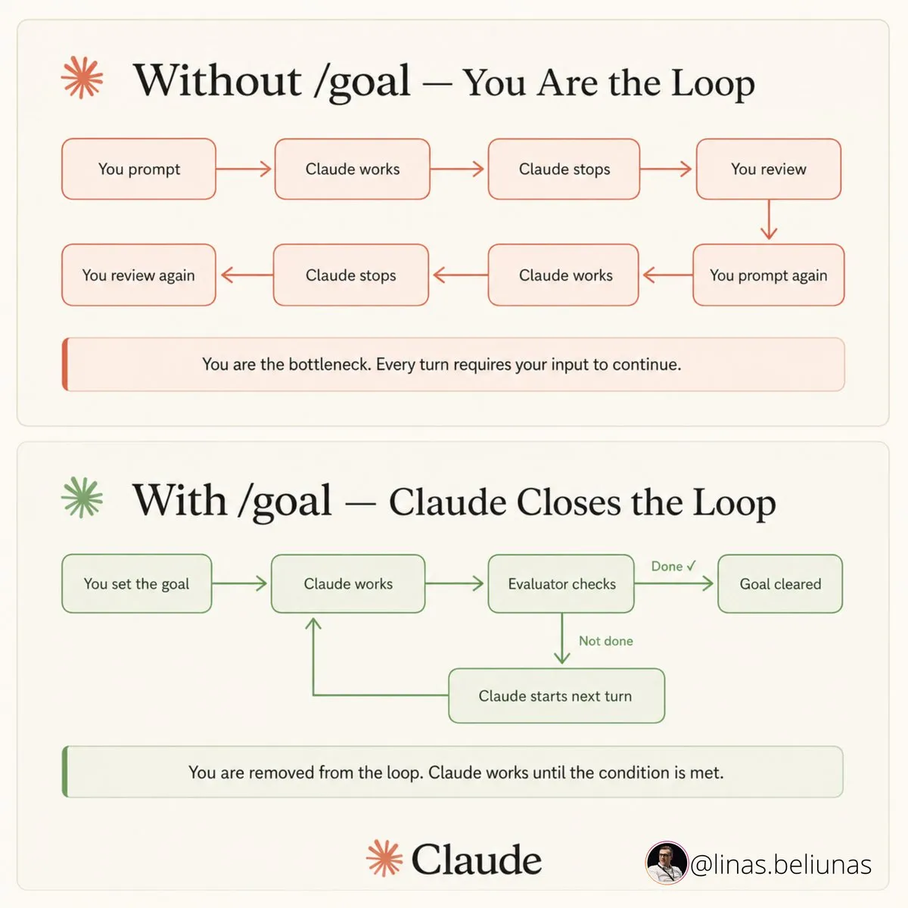

[⬅️](../Claude_Code_Knowledge_Base.md)

## 📝 TL;DR

Loop engineering — це перехід від ручного промптингу до проектування систем, що самі промптять агента: знаходять задачі, запускають агента, верифікують результат і вирішують наступний крок. Перш ніж будувати цикл — пройди 4-умовний тест. Більшість розробників ще не готові до цього підходу.

## Концепція

Точка важеля змістилася: раніше — якість промпту, тепер — якість системи, що генерує промпти сама. Людина більше не стоїть у циклі "написав → почекав → прочитав diff → написав знову". Натомість вона проектує цикл, що крутиться самостійно.

Кожна ітерація атомарна і не залежить від того, скільки часу минуло між запусками:

```text
1. Тригер запускає агента (вручну / /loop / cron — неважливо)
         ↓
2. Агент читає state file → бачить що вже зроблено
         ↓
3. Агент звертається до MCP-конектора (GitHub, Linear, Jira)
   → отримує нові або відкриті задачі
         ↓
4. Виконує наступну порцію роботи
         ↓
5. Записує оновлений state file → фіксує прогрес
         ↓
6. Завершується
```

Наступного разу — знову з кроку 1. "Loop" — не нескінченний процес, а замкнений цикл із пам'яттю.



## 4-умовний тест (перед будь-яким циклом)

Всі чотири умови мають виконуватися одночасно:

1. **Повторюваність** — задача виникає хоча б щотижня.
2. **Авто-верифікація** — результат можна перевірити автоматично (тести, білд, лінтер).
3. **Токен-бюджет** — команда може дозволити собі "пусті" ітерації.
4. **Інструменти агента** — агент має доступ до логів, відтворюваного середовища, інструментів рівня senior.

Якщо хоча б одна умова не виконується — цикл будувати зарано.

## 5 будівельних блоків

### 1. Automations (серцебиття циклу)

Тригери, що запускають агента без участі людини:

- `/loop` — за частотою (наприклад, `/loop 5m check the deploy`).
- `/goal` — за умовою ("працюй поки всі тести не зелені"); показує live-панель elapsed/turns/tokens.

Continuity між сесіями забезпечує не `/loop`, а **state file** (крок 10): кожна нова ітерація читає файл і продовжує з того місця де зупинилась — незалежно від того, та сама це сесія чи нова. `/loop` — лише один із можливих тригерів; замість нього може бути `CronCreate`, системний cron або ручний запуск. Підхід від цього не змінюється.

### 2. Worktrees (паралельність без конфліктів)

Git worktrees дозволяють кільком агентам працювати паралельно в ізольованих копіях репозиторію. Без них — конфлікти файлів при одночасних записах.

→ Детальніше: [Worktree Isolation](Worktree_Isolation.md)

### 3. Skills (накопичене знання)

Знання про проєкт зберігається у `SKILL.md` та підключається до циклу. Агент не "переучується" кожного запуску — він стартує з готовим контекстом.

→ Детальніше: [Скіли, плагіни та MCP](Skills_and_MCP.md)

### 4. Connectors (зовнішній світ)

MCP-з'єднання з GitHub, Linear, Slack та іншими інструментами. Цикл може: читати тікети, відкривати PR, надсилати сповіщення.

→ Детальніше: [Розробка власного MCP-сервера](MCP_Server_Development.md)

### 5. Sub-agents (розділення ролей)

Виконавець і верифікатор — різні агенти. Агент, що написав код, не може об'єктивно його перевірити ("self-grading" bias).

→ Детальніше: [Архітектура субагентів](Subagents_Architecture.md)

## Складання циклу (кроки 10–14)

### State files (крок 10)

State file — це закладка в книзі: позначаєш сторінку де зупинився, щоб наступного разу не починати з першої.

Уяви цикл, що обробляє GitHub-тікети: знаходить відкриті задачі, запускає агента, закриває. Без state file — кожен запуск бере всі відкриті тікети з початку. Деякі вже оброблялись, але цикл про це не знає — дублі, повторна робота, плутанина.

З state file — цикл читає: "останній оброблений тікет #47, час запуску 14:00". Наступний запуск стартує з #48.

Зазвичай це простий markdown або JSON файл, який цикл читає на початку і перезаписує в кінці. Без нього цикл амнезійний.

Мінімальний цикл оновлення state file виглядає так:

```text
# На початку кожного запуску:
state = read("STATE.md")          # де зупинились
items = connector.get_open()      # що є зараз
next  = items.after(state.last)   # що ще не оброблено

# Виконуємо роботу:
result = agent.run(next)

# В кінці кожного запуску:
state.last    = next.id
state.updated = now()
write("STATE.md", state)          # фіксуємо прогрес
```

Два патерни розміщення:

**Markdown у репозиторії** (`STATE.md` у корені або в `.claude/`) — під version control, читається з дифів, просто. Підходить для соло або невеликої команди.

**Зовнішня система** (Linear, GitHub Issues, БД) — переживає переїзди між репозиторіями, підтримує запити, дає видимість усій команді. Підходить для production-циклів, де за роботою циклу мають стежити кілька людей.

Для довгограючих циклів, що ризикують збитися з курсу, до state file додають постійну високорівневу специфікацію — `VISION.md` або `AGENTS.md`, — яку агент перечитує на кожному запуску. State file каже агенту **де він зараз**. Специфікація каже **куди йти**.

### Minimal Viable Loop (крок 11)

MVL — це MVP для циклу: запусти найменше що може працювати, перш ніж нарощувати складність. Не проєктуй одразу 20 станцій — спочатку зроби одну стрічку, що рухається від початку до кінця.

Чотири елементи — мінімум щоб цикл був живим:

- **Automation** — щось запускає агента (за розкладом або умовою). Без цього цикл не крутиться сам.
- **Skill** — агент знає про проєкт. Без цього витрачає контекст на переучування щоразу.
- **State file** — цикл памʼятає де зупинився. Без цього стартує з нуля і повторює вже зроблене.
- **Objective gate** — є чіткий критерій "готово". Без цього — Ralph Wiggum (крок 12).

Прибери будь-який з чотирьох — і цикл або не запускається, або крутиться вхолосту, або ніколи не зупиняється.

### Failure mode: Ralph Wiggum (крок 12)

Ральф Вігум — персонаж із "Сімпсонів", син шерифа. Відомий тим, що абсолютно щиро і впевнено говорить повну нісенітницю — без жодного сумніву і без розуміння що щось пішло не так.

Агент у цьому failure mode поводиться так само: рапортує "задачу виконано" — щиро, впевнено, без жодного злого умислу. Просто не розуміє, що нічого не зробив.

Це трапляється коли агент оцінює свій результат сам: "я написав код → код виглядає правильно → готово". У автономному циклі без нагляду людини такий агент може прокрутити десятки ітерацій, рапортуючи успіх, поки насправді нічого не змінюється.

Рішення — **objective gate**: критерій завершення, який перевіряється автоматично, а не агентом. Тести пройшли — ок. Білд зібрався — ок. PR відкрито з непорожнім diff — ок. Будь-що, що не залежить від самооцінки агента.

### Understanding Debt (крок 13)

Коли цикл генерує код сам — дуже легко перестати читати що він написав. Тести зелені, білд проходить. Навіщо дивитись?

Через місяць щось падає в проді. Ти відкриваєш файл — і не розумієш що там відбувається. Не тому що код поганий, а тому що ніхто в команді ніколи не розбирався як це влаштовано: цикл написав, CI схвалив, пішло.

Це і є **understanding debt** — аналог технічного боргу, але не в коді, а в головах людей. Крайній варіант — **cognitive surrender**: команда взагалі перестає думати критично про те що агент робить.

У ручному режимі ти читаєш diff перед кожним комітом — бо сам написав промпт і чекаєш результату. В автономному циклі diff зʼявляється сам, тихо, і дуже легко натиснути merge не заглядаючи.

**Правило:** агенту можна делегувати написання коду. Розуміння — не можна.

### Security Tax (крок 14)

Назва влучна: це не опція, а ціна за автоматизацію. Чим автономніший цикл — тим вищий податок.

Уяви підрядника, що працює в офісі без нагляду: дав ключ, доступ до серверної, пароль від адмін-панелі. Поки він тут — все ок. Але якщо ключ не змінювати роками і доступи не переглядати — ти навіть не помітиш коли щось піде не так. Автономний цикл — той самий підрядник: має токени, API-ключі, права на push, і працює без нагляду.

Три проблеми, що виникають з часом:

**Повзуча акумуляція прав.** Щоразу "просто додамо ще один MCP-конектор", "дамо доступ до prod-логів". Старі права ніхто не відкликає. Через рік агент має доступ до всього — і ніхто не памʼятає навіщо.

**Секрети у коді.** Агент пише код сам і може випадково захардкодити токен або ключ, якщо вони потрапили в контекст. CI цього не перехопить без secret scanning.

**Немає воріт перед merge.** Код від циклу летить у main так само тихо як і state file. Без автоматичної перевірки безпеки вразливість може потрапити в прод непоміченою.

Тому три обовʼязкових пункти:

- **Access review** — регулярно переглядати що і до чого має доступ цикл, відкликати зайве.
- **Secret scanning у CI** — перехоплювати випадково закомічені секрети до merge.
- **Security gate перед merge** — автоматична перевірка коду від агента, як і будь-якого іншого коду.
- **Hard spend limit** — виставити жорсткий фінансовий ліміт на рівні провайдера (Anthropic Console → Settings → Limits) до першого запуску будь-якого `/loop`. Автономні цикли вразливі до нескінченних ітерацій через поганий системний промпт — без ліміту рахунок може злетіти непоміченим.
- **Circuit breaker** — обмежити кількість невдалих ітерацій поспіль. Якщо N разів підряд objective gate не пройдено — цикл зупиняється і сповіщає людину, а не продовжує витрачати токени. Для коду: якщо цикл замерджив щось що поламало прод — мати готовий `git revert` або snapshot БД перед кожним запуском циклу.

## Хороші перші цикли

Приклади задач, що добре проходять 4-умовний тест і підходять для першого експерименту з циклами:

**Сортування падінь CI.** Вночі — просканувати падіння за день, класифікувати причини, для простих випадків сформувати PR із фіксом. Верифікація автоматична: якщо CI зеленіє — цикл спрацював.

**PR з оновленням залежностей.** Щотижня шукати нові версії, перевіряти сумісність, відкривати PR. Повторюваність і авто-верифікація через тести — вбудовані в задачу.

**Відтворення флапаючих тестів.** Цикл крутить тест знову і знову, поки гіпотеза про причину флапу не витримає N запусків поспіль. Зупиняється за чітким числовим критерієм — не "схоже стабільно".

**Чернетки PR із задач.** Для задач у трекері з хорошим тестовим покриттям — цикл відкриває PR-чернетку. Об'єктивний gate: тести проходять. Поганий результат відбраковується автоматично, без перегляду людиною.

Що спільного: у кожному є **чіткий тригер**, **авто-верифікація** і **обмежений scope** — агент не вирішує що робити, він виконує конкретну вузьку задачу.

## Кому це ще не потрібно

**Більшість розробників не потребують циклів.** Умови готовності:

- є дійсно повторювані задачі
- є автоматична верифікація (не "подивлюся на код")
- є надлишок токен-бюджету
- агент має інструменти рівня senior

На стандартних планах і без CI-покриття — переваги нівелюються витратами і ризиками.

## Антипатерни

- Пропустити 4-умовний тест.
- Відсутність objective gate — покластися на "агент сам вирішить".
- Один агент пише і перевіряє.
- Немає ліміту на токени — цикл може "вилетіти" в нескінченність.
- Запускати цикли на споживчих тарифах (consumer pricing).
- Автоматизувати архітектурні рішення.
