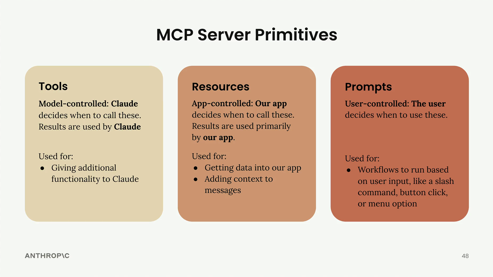

[⬅️](../Claude_Code_Knowledge_Base.md)

## 📝 TL;DR

MCP має три примітиви з чітким поділом відповідальності: **Tools** контролює модель, **Resources** — застосунок, **Prompts** — користувач. Вибір примітиву залежить від того, хто ухвалює рішення про його використання.

## Фреймворк: хто контролює



| Примітив | Контролює | Результат використовує |
| :--- | :--- | :--- |
| **Tool** | Модель (Claude) | Claude |
| **Resource** | Застосунок | Застосунок або промпт |
| **Prompt** | Користувач | Модель |

## Tools — model-controlled

Claude самостійно вирішує коли і які tools викликати. Результат повертається моделі і використовується для відповіді.

**Коли використовувати:** потрібно дати Claude нові можливості для автономного виконання — обчислення, запити до БД, виклики API.

**Приклад:** "порахуй квадратний корінь з 3 через JavaScript" → Claude вирішує викликати `execute_js`, отримує результат, формує відповідь.

## Resources — app-controlled

Застосунок вирішує коли і які ресурси підтягнути. Ресурси адресуються через URI і зазвичай використовуються для:

- наповнення UI-елементів (autocomplete, списки вибору)
- збагачення промпту контекстом перед відправкою моделі

**Коли використовувати:** потрібно отримати дані в застосунок — для відображення або вставки в контекст.

**Приклад:** "Add from Google Drive" у Claude.ai — застосунок вирішує які документи показати і вставляє їх вміст у контекст чату.

## Prompts — user-controlled

Користувач явно запускає промпт через UI-дію: кліком, командою (`/назва`), пунктом меню. Промпти — це предефіновані оптимізовані workflow.

**Коли використовувати:** хочеш дати користувачу готові workflow для типових задач.

**Приклад:** кнопки під полем вводу в Claude.ai — кожна запускає конкретний промпт-шаблон одним кліком.

## Шпаргалка вибору

```text
Потрібно дати Claude нові можливості?      → Tools
Потрібно отримати дані в app або контекст? → Resources
Потрібно готовий workflow для користувача? → Prompts
```

## Пов'язані нотатки

- [MCP — огляд та визначення](MCP_Overview.md)
- [Розробка власного MCP-сервера](MCP_Server_Development.md)
